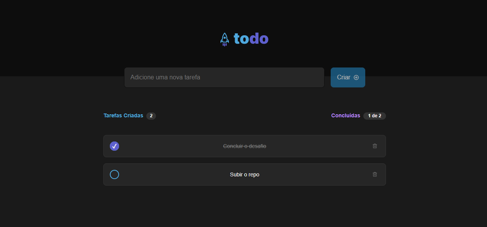

## IGNITE CHALLENGE - TODO LIST

---

## Sobre 📝

Aplicativo desenvolvido como primeiro desafio do programa Ignite da [RocketSeat](https://rocketseat.com.br/ignite)

---

## Layout 📐

  

    
  

---

## Ferramentas 🛠

- React.js
- Typescript
- CSS
- HTML

---

## Como usar 💻🚀

- Faça o download do projeto para o seu computador ou use o comando `git clone https://github.com/WagnerLeodoro/to-do-list.git`
- Abra a pasta to-do-list no seu terminal
- Rode o comando `npm install` para instalar o módulos do projeto

### Visualização Webpage

Abra a pasta to-do-list numa aba do terminal e rode o comando `npm run dev`

# License 📕

Lançado em 2022 📕 License

This project is under the [MIT license](./LICENSE).
